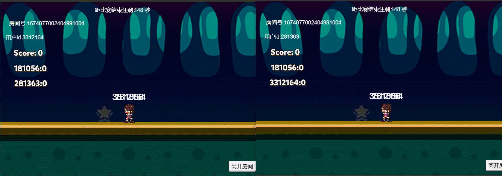

# Matchvs_demo_creator
- [官网](http://www.matchvs.com/serviceDownload)
- [在线体验链接](http://demo.matchvs.com/demo-creator/)

**注意** 本demo支持creator1.X，creator2.X版本，如果有什么不明白的地方，可以加入Matchvs官网技术支持群450335262。欢迎你对我们的产品提出建议。

用Matchvs SDK 和 creator 开发的多人摘星星，用于演示多人匹配、数据传输、帧同步、消息订阅等功能，下面是游戏内同步效果图。

 

## 1：加载插件

文件路径demo/assets/script/Matchvs.js

Matchvs.js文件主要用于加载插件以及在native环境下加载JSB。

在V3.7.4.3版本中使用最新SDK插件，在Native环境下不在使用JSB的的方式去加载。

## 2：Matcvhs SDK使用的封装

 1: 文件路径demo/assets/script/MatchvsEngine.js

主要封装了Matchvs SDK的主要功能请求。 例如 login ，registerUser等。

 2: 文件路径demo/assets/script/MatchvsResponse.js

主要封装了Matchvs SDK的主要功能请求的异步回调，以及一部分通知。例如 loginResponse joinRoomNotify。 在这里收到对应的通知或通知以后，在通过 cocos的事件传递机制把对应的数据传递出去，

[cocos 事件传递机制参考地址 ](http://docs.cocos.com/creator/manual/zh/scripting/events.html?h=%E4%BA%8B%E4%BB%B6%E4%BC%A0%E9%80%92)

 3: 文件地址 demo-creator/assets/scripts/MatvhvsMessage.js

主要封装了事件传递所需的一些常量；

## 3：cocosCreatorDemo的使用

### 1：调试

 1：单浏览器调试：下载demo代码，在Creator运行使用浏览器调试，登陆成功以后，再次在creator点击预览，在demo 首页点击clera，在点击登陆，即可在一个浏览器工具上进行预览调试。
 2：多浏览器调试：下载demo代码，在Creator运行使用浏览器调试，拷贝预览url ，打开不同浏览器，输入url，即可进行调试。

### 2：demo assets文件夹下文件的含义。

anim放的是对应的动画文件。 

prefab放的是对应的预制体。

scripts 放的是对应的JS文件。

没有放入文件夹的是对应的场景文件。

### 3：功能性的JS文件。

 1：文件路径demo/assets/script/Glb.js

主要存放了一些全局变量，游戏的appKey  secret gameID。就存放在这里，如果需要改成自己创建的GameID，在此处修改。

 2：文件路径demo/assets/script/wxshare.js

主要存放了一些微信所需第三方方法，微信分享，获取微信头像等。

 3：文件路径demo/assets/script/Player.js

主要负责游戏场景人物的移动逻辑。

 4：文件路径demo/assets/script/md5.js

负责MD5加密。

### 4：demo运行的基本流程

login —> Lobby -> Match -> game -> result -> Lobby;

登陆 ——》大厅 ——》 随机匹配 ——》游戏场景 ——》 结算页面 ——》大厅。

### 5：TS登陆代码与JS登陆代码的切换。

  1：文件地址demo/assets/script/Login/Login.js
	
	需要使用JS代码进行登陆操作时候需要注册 Login.Ts代码中的start方法内的代码注释即可。
  
  2: 文件地址demo/assets/script/Login/Login.Ts
		
	需要使用Ts代码进行登陆操作时候需要注册 Login.js代码中的start方法内的代码注释即可。 	
		
**注意** Ts代码仅编写了登陆页面作为参考。没有做后续的功能。如果需要查看所有功能请使用JS代码进行调试。
		
### 6：Change Log

V3.7.4.3

1：优化demoUI，对demo页面进行美化。

2：demo进行creator2.0+版本的适配工作。支持了creator全版本。

